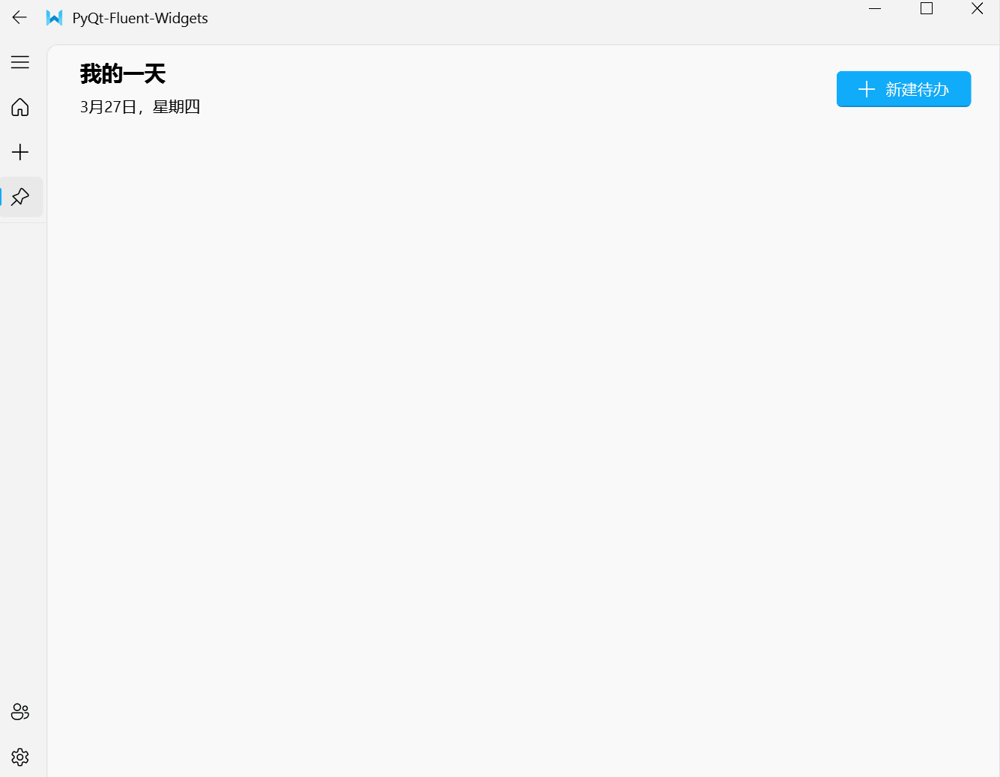
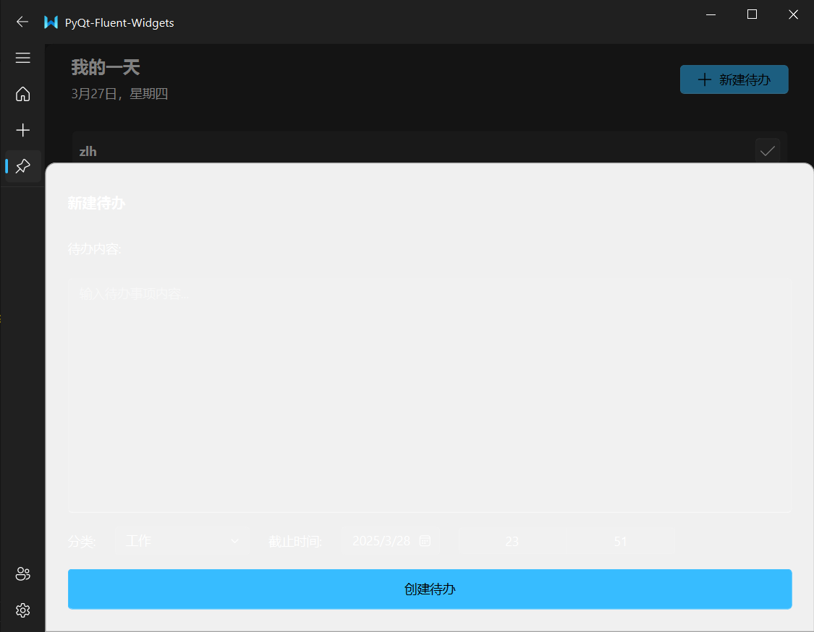
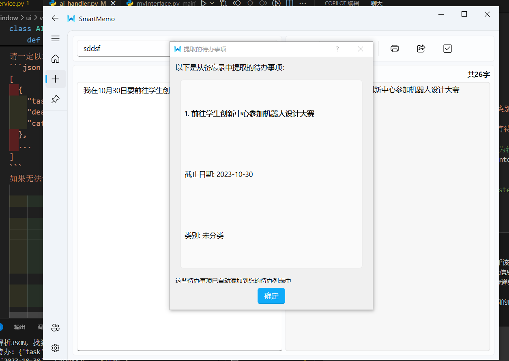
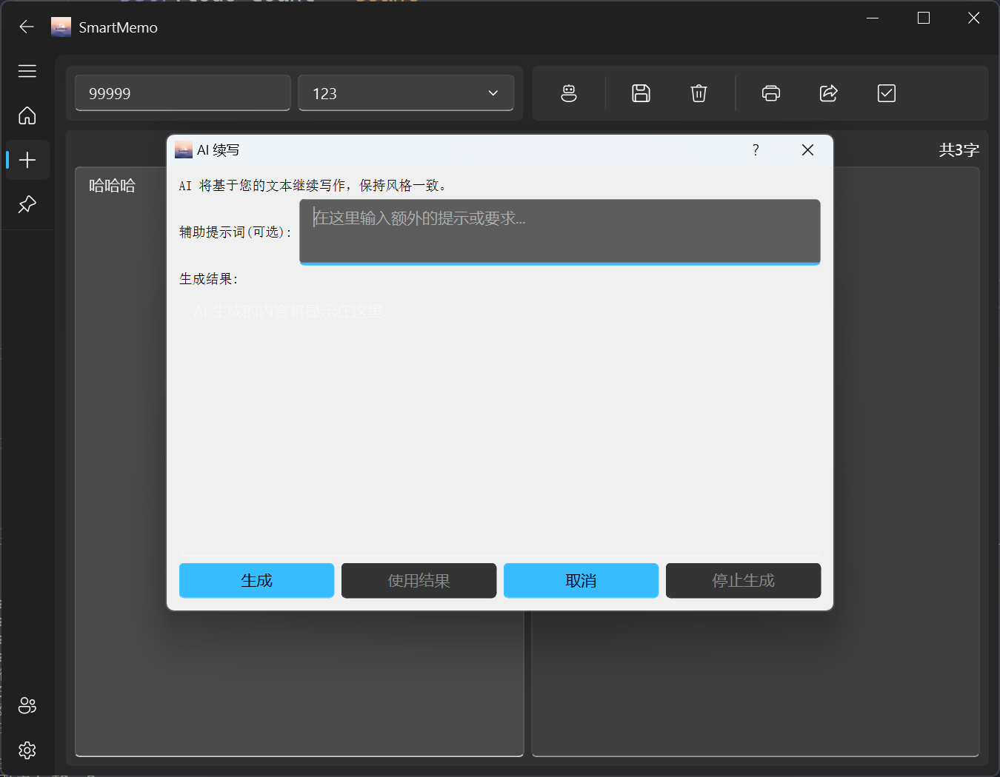

# Smart-Memo-Manager

TODO:
- [x] 神秘崩溃bug。
  
- [x] 超过一行的备忘录，在首页显示时非常奇怪。
- [x] 新建完成一个帖子之后点击保存，切回主页，再切回新建页面仍然是这个帖子。这就导致不能再新建帖子了。
- [x] 用户输入的字莫名其妙变成灰色。
- [x] AI自动补全灰色字体，直接点击保存能直接把灰色字体保存下来。
- [x] 编辑帖子保存之后，主页的预览不会更新。
- [x] 首页帖子布局应当从上到下排布，而非居中。
- [x] 主页以及新建页面，界面最好不要固定大小。
- [x] 分享界面会抽搐（？）
- [x] 分享界面的PrimaryPushButton的图标颜色不正确。
- [x] 收藏功能没有显式展现出来，可以有一个五角星的收藏按钮，收藏之后就变黄。（这个放待办事项里再做吧）
- [x] 搜索功能疑似还没做
- [x] 删除功能
- [x] 待办页面
- [x] 云端同步
- [x] 续写直接接到原文本后面
- [x] 排序按钮使用CheckableMenu
- [x] 首页的导出功能有bug
- [x] 编辑备忘录界面上的TextEdit还不能实现Markdown实时渲染。不好做，打算搞双面板
- [x] 为自动补全添加开关、设置多久时间光标不动才补全这种
- [x] AI的API需要换个平台？或者给用户来选择？
- [ ] AI功能中还有其他可选项（看手机备忘录），以及添加用户自定义提示词
- [x] 数据库中需要添加每个用户添加过的历史tag，并在编辑备忘录界面中显示这些tag
- [x] AI功能中可以添加：通过读取备忘录中的内容，分析其中是否存在待办事项，并把待办事项添加进去
- [x] 当主题设置为暗黑模式时，登录注册界面有颜色异常。
  

- [x] 当处于暗黑模式下时，分享界面不能变色
- [x] 启动界面
- [x] 待办页面未设置透明背景
- [x] 新建待办的页面会抽搐打不开
  
- [ ] 自动补全功能补全的内容和原文会重叠在一起
  
- [x] 新建待办的页面在暗黑模式下有显示bug
  
- [ ] AI提取备忘录导入待办有些问题（时间等，时间或许可以搞些和当前时间的比对），也可以添加按钮让用户选择是否选择导入
  
- [ ] AI消息框的暗黑模式异常

- [ ] 待办事项置顶之后，完成按钮与置顶图标重叠。